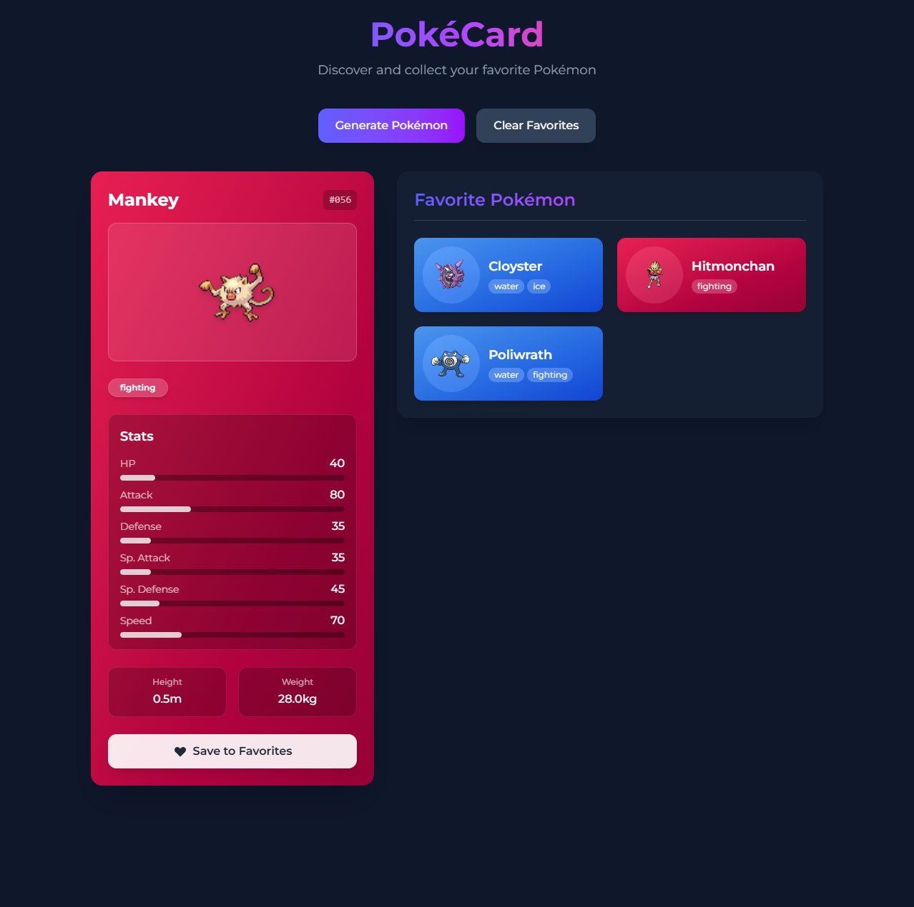
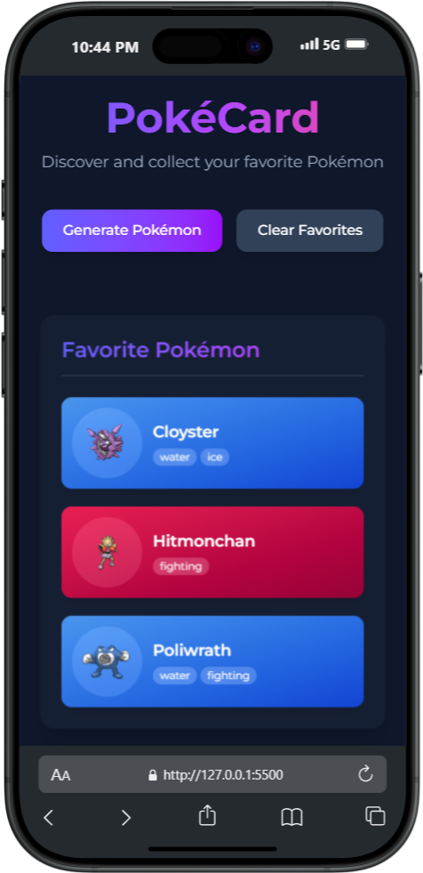
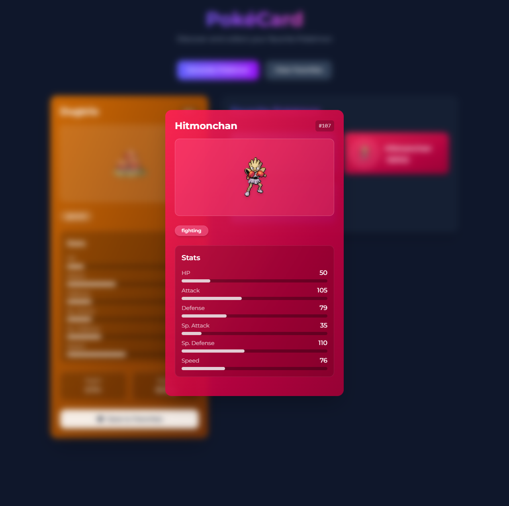

# Route-151: Pokémon Collection & Battle TCG

A progressive web application that lets you collect, battle, and trade Pokémon cards. Journey through Route-151 to become the ultimate Pokémon master!


## Project Overview

This project follows a multi-tier development pathway designed to build skills incrementally:

1. **Tier 1**: ✅ Pokémon card collection with core web technologies
2. **Tier 2**: React-based implementation with expanded collection features
3. **Tier 3**: Full-fledged trading card game with battles, trades, and online play

## Features

### Tier 1: Pokémon Card Collection ✅

- ✅ Random Pokémon card generation using PokeAPI
- ✅ Display of Pokémon stats, image, and information
- ✅ Save favorites to your collection with Local Storage
- ✅ Responsive design with Tailwind CSS
- ✅ Clean UI with intuitive controls
- ✅ Interactive collection with detail view

### Tier 2: React Conversion & Enhanced Collection

- Modular component architecture
- Global state management with Context API
- Multi-page routing with card discovery journeys
- Enhanced UI/UX with React's dynamic rendering
- Persistent collection across sessions
- Card rarity system and special editions
- Loading states and improved error handling

### Tier 3: Trading Card Game System

- User authentication and trainer profiles
- Expanded collection with card trading functionality
- Strategic battle system based on Pokémon stats and types
- Battle history and trainer statistics
- Leaderboards, achievements, and special events
- Online multiplayer battles and trading marketplace

## **Screenshots**

|  |  |  |
| :----------------------------------------------: | :-------------------------------------------: | :------------------------------------------: |
|               Route-151 on Desktop               |              Route-151 on iPhone              |              Card Detail Overlay             |

## Technologies Used

### Current Implementation (Tier 1)

- HTML5, CSS3, JavaScript (ES6+)
- Tailwind CSS
- PokeAPI
- LocalStorage for data persistence

### Upcoming (Tier 2 & 3)

- **Frontend**: React, Tailwind CSS
- **State Management**: Context API, React Hooks
- **Backend**: Node.js/Express (or Firebase)
- **Database**: MongoDB (or Firebase)
- **Authentication**: JWT or Firebase Auth
- **API**: PokeAPI
- **Deployment**: Netlify, Render, or AWS

## React Migration Planning

### Component Structure

- `App` - Main application container
- `Header` - Application title and description
- `ControlPanel` - Generate and Clear buttons
- `PokemonCard` - Display current Pokémon
- `FavoritesSection` - Container for favorites
- `FavoriteCard` - Individual favorite Pokémon
- `PokemonDetail` - Modal overlay for detailed view
- `LoadingSpinner` - Loading indicator

### State Management

- Current Pokémon data
- Favorites collection
- UI states (loading, errors, modal visibility)

## Getting Started

### Prerequisites

- Node.js (v14 or higher)
- npm or yarn

### Installation

```bash
# Clone the repository
git clone https://github.com/IVIonsters/poke-card-generator.git

# Navigate to project directory
cd poke-card-generator

# Install dependencies
npm install

# Start development server
npm start
```

## Project Structure

### Current Structure (Tier 1)

```
poke-card-generator/
├── index.html
├── script.js
├── output.css
└── README.md
```

### Planned React Structure (Tier 2)

```
poke-card-generator/
├── public/
├── src/
│   ├── components/
│   │   ├── PokemonCard.jsx
│   │   ├── FavoriteCard.jsx
│   │   ├── Header.jsx
│   │   ├── ControlPanel.jsx
│   │   ├── FavoritesSection.jsx
│   │   └── PokemonDetail.jsx
│   ├── context/
│   │   └── PokemonContext.jsx
│   ├── hooks/
│   │   └── usePokemonData.js
│   ├── utils/
│   │   ├── api.js
│   │   ├── storage.js
│   │   └── formatters.js
│   ├── App.jsx
│   └── index.js
├── .gitignore
├── package.json
└── README.md
```

## Roadmap

- [x] Tier 1: Static Card Generator
- [ ] Tier 2: React Implementation
  - [ ] Set up React project
  - [ ] Convert HTML/CSS to components
  - [ ] Implement context for state management
  - [ ] Add loading states and error handling
  - [ ] Enhance responsive design
- [ ] Tier 3: Battle System Integration
  - [ ] User authentication
  - [ ] Database integration
  - [ ] Battle mechanics
  - [ ] Leaderboards and achievements

## **Future Improvements**

- Add search functionality for Pokémon by name or type
- Implement advanced filtering options
- Add accessibility features
- Support for comparing multiple Pokémon stats
- Add animated transitions between cards
- Implement dark/light theme toggle

## Contributing

Contributions are welcome! Please feel free to submit a Pull Request.

## **License**

This project is licensed under the MIT License - see the [LICENSE](LICENSE) file for details.

## Acknowledgments

- [PokeAPI](https://pokeapi.co/) for providing the Pokémon data
- The Pokémon Company for the inspiration

---

Made with ❤️ by Zachary
